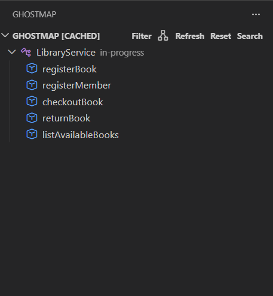
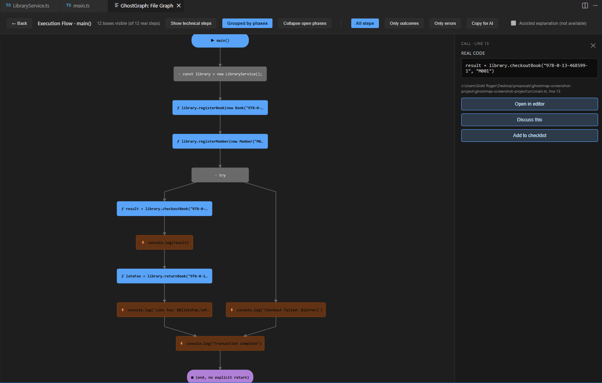
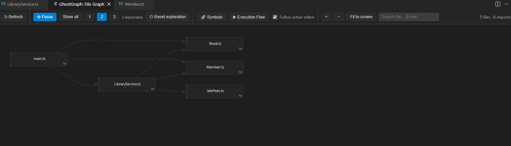
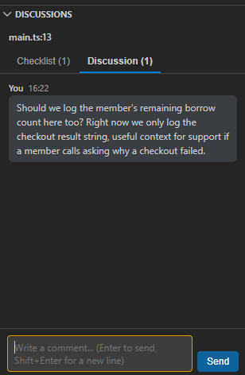
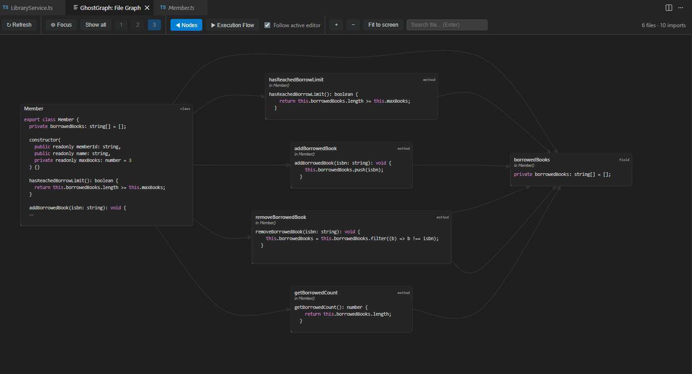
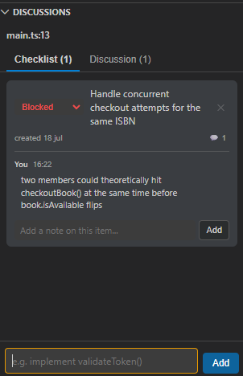

# GhostMap

**Understand a codebase without reading every file.**

GhostMap is a local-first VS Code extension that extracts real code
structure using Tree-sitter and ts-morph, then turns symbols,
dependencies, control flow, diagnostics, and code-anchored discussions
into something you can navigate, instead of reconstructing in your head,
file by file.

**[Install V1 →](https://marketplace.visualstudio.com/items?itemName=Ghostmap.ghostmap)** &nbsp;·&nbsp;
**[Explore the beta ↓](#-private-beta)** &nbsp;·&nbsp;
**[Read the architecture →](docs/ARCHITECTURE.md)**

---

## At a glance

- **19** supported languages for symbol extraction (TypeScript, TSX,
  JavaScript, JSX, C#, Java, C++, C, Go, Rust, PHP, Python, Ruby, Dart,
  Scala, Solidity, Julia, Elixir, Objective-C)
- **766+** automated tests (unit, matrix, smoke) across all supported languages
- **Published** on the VS Code Marketplace
- **Local-first**  all parsing, indexing, and storage run entirely on your machine
- **~80s → ~1s** cached symbol-tree load time on a 60,000-line file
- **12** control-flow-analysis languages in private beta, each with its own
  extraction adapter (TypeScript and JavaScript share one, so that's 12
  adapter files for the 12 documented languages)

---

## Explore the product

| | |
|---|---|
| [](#symbol-tree-live) | [](#control-flow-analysis-private-beta) |
| **Symbol Tree** `LIVE`<br>Navigate real functions, classes, and `@ghost` annotations across 19 languages.<br>[See how it works ↓](#symbol-tree-live) | **Control Flow Analysis** `PRIVATE BETA`<br>Inspect parser-backed execution paths — branches, loops, returns, expandable calls.<br>[See how it works ↓](#control-flow-analysis-private-beta) |
| [](#file-graph-private-beta) | [](#code-anchored-discussions--checklists-private-beta) |
| **File Graph** `PRIVATE BETA`<br>Cross-file import resolution, cycle detection, broken-import diagnostics.<br>[See how it works ↓](#file-graph-private-beta) | **Code-Anchored Discussions** `PRIVATE BETA`<br>Comments and checklists tied to an exact line, with anchor healing.<br>[See how it works ↓](#code-anchored-discussions--checklists-private-beta) |
| [](#symbol-graph-private-beta) | |
| **Symbol Graph** `PRIVATE BETA`<br>Per-file extraction of functions, classes, and their real source.<br>[See how it works ↓](#symbol-graph-private-beta) | |

---

## What is live today

**✅ V1 — published on the VS Code Marketplace**

- Symbol tree across 19 languages, extracted by a real parser, not
  regex, navigating every function, class, and comment in a file.
- `@ghost` annotations linking a status (`todo`, `blocked`, `review`,
  `done`...) to the nearest real symbol, with real-time diagnostics
  for malformed annotations as you edit.
- Local-first architecture, nothing about your code leaves your editor.
- Symbol tree caching that brought load time on files up to 60,000 lines
  from roughly 80 seconds down to about 1 second.

## 🚧 Private beta

Being built and tested in real projects right now, not yet on the
Marketplace.

- Static, per-function control-flow analysis across 12 languages, with
  real per-language semantics (Python's `for/else`, Scala having no
  `break`/`continue`, switch fallthrough rules that differ language to
  language) instead of one shared implementation. Resolved calls can be
  expanded on demand to follow execution into the called function.
- File Graph, cross-file import resolution, circular dependency
  detection, and diagnostics for imports that fail to resolve.
- Symbol Graph, per-file extraction of functions, classes, and their
  source, browsable alongside the File Graph.
- Code-anchored discussions & checklists, with anchor healing so a
  comment survives the surrounding code shifting, and multi-anchor
  support for one discussion tied to more than one point in the code.
- AI integration (VS Code Language Model API) used strictly *after*
  deterministic structural analysis, to explain a flow already
  verified by the parser, never to infer the structure itself.

---

## Diagnostics `LIVE`

**What it does.** Flags problems with `@ghost` annotations in real time:
an unclosed range, a range-end with no matching start, malformed
annotation syntax, an annotation that isn't attached to any real symbol,
and ambiguous cases where more than one symbol could own it.

**Why it matters.** An annotation that silently attaches to the wrong
symbol, or doesn't attach to anything, is worse than no annotation —
GhostMap surfaces that instead of guessing.

**Status.** Live on the Marketplace. *(Screenshot coming soon.)*

---

## Symbol Tree `LIVE`


**What it does.** Extracts every function, class, and comment in a file
into a navigable tree, using each language's real grammar (Tree-sitter,
or ts-morph for TypeScript) rather than pattern matching on text.

**`@ghost` annotations.** A status marker (`todo`, `blocked`, `review`,
`pending`, `in-progress`, `done`) attaches to the nearest real symbol and
shows up directly in the tree, `LibraryService` above is marked
`in-progress`, right next to the class name, no separate panel needed.

**Status.** Live on the Marketplace, across 19 languages.

---

## Control Flow Analysis `PRIVATE BETA`


**What it does.** Builds a control-flow graph for one function or method
at a time, branches, loops, returns, throws, and call sites, using a
dedicated extraction adapter per language rather than one generic
implementation.

**Following calls.** A call site that resolves to a known function isn't
a dead end: it can be expanded on demand, inserting that function's own
flow into the sequence in place of the call, with cycle protection for
recursive calls. A `throw` inside an expanded call is deliberately left
unreconnected, it represents an exception propagating outward, not a
normal continuation.

**Filters** to narrow a large flow down to just outcomes, just error
paths, or grouped phases, visible in the toolbar above
(`All steps` / `Only outcomes` / `Only errors` / `Grouped by phases`).

**Status.** Private beta, not yet public. Supported across the 12
documented languages: TypeScript/JavaScript, Python, Ruby, PHP, Go,
Java, C#, C++, Rust, Scala, Groovy, and Objective-C, plus an
additional Solidity adapter that exists but isn't yet covered by the
same test matrix as the other 12.

---

## File Graph `PRIVATE BETA`


**What it does.** Maps how files in a project actually import each
other, real import resolution followed across files, not a guess based
on naming conventions, and surfaces circular dependencies and broken
imports (with similarity-based "did you mean" suggestions for a typo'd
import name) before they turn into a runtime error or a confusing
review comment.

**Status.** Private beta, not yet public.

---

## Symbol Graph `PRIVATE BETA`


**What it does.** Extracts the functions and classes in a single file,
with their real source, as its own browsable graph next to the File
Graph, the level below "which files import which," down to "what does
this function actually contain."

**Status.** Private beta, not yet public. Currently one file at a time;
does not yet resolve calls across files the way Control Flow Analysis's
call expansion does.

---

## Code-Anchored Discussions & Checklists `PRIVATE BETA`

A comment or task tied to an exact line in the code, stored locally in
the project (not synced to a server or shared in real time between
collaborators yet, that would need a real backend, deliberately not
built for this beta).

| | |
|---|---|
|  |  |

**How anchor healing works.** Each anchor stores a hash of its line's
content (trimmed; for very short lines, a hash of the line plus its
neighbors, to avoid ambiguous matches on things like a lone closing
brace). If the exact line no longer matches, GhostMap searches outward
line by line, up to 30 lines in each direction, for content matching
that same hash, and marks the anchor "healed" if found, or "stale" if
not, rather than silently attaching to the wrong line.

**Multi-anchor.** One discussion can stay tied to more than one point at
once (a client call and its server handler, for example).

**Status.** Private beta, not yet public.

---

## Trust boundaries

GhostMap separates verified facts from generated explanation:

- **Parser-verified**, symbols, branches, loops, returns, imports,
  resolved call targets, and every graph edge.
- **Heuristic, and labeled as such**, broken-import "did you mean"
  suggestions, and healed anchors (marked `healed` or `stale`, never
  silently treated as `exact`).
- **AI-generated**, natural-language explanations of a structure
  that's already been extracted deterministically.

AI output never becomes a graph edge or a structural fact without
parser evidence behind it.

---

## Architecture snapshot

```text
Source files
    ↓
Language-specific extraction adapters (Tree-sitter / ts-morph)
    ↓
Shared graph model, FlowNode / FlowEdge, File Graph, Symbol Graph
    ↓
Per-document cache (keyed by URI + version, tiered reuse)
    ↓
Symbol tree · diagnostics · control flow · discussions & checklists
    ↓
Optional AI explanation (only on top of the verified structure above)
```

Each language adapter normalizes its own grammar into the same shared
node/edge model; the renderer and the caching layer don't need to know
which language produced a given graph.

---

## Engineering highlights

- Designed a shared graph model (`FlowNode`/`FlowEdge`) that 12
  language-specific extraction adapters all normalize into, so the
  renderer and every downstream feature stay language-agnostic.
- Built on-demand call expansion for control-flow graphs, with
  recursion protection and explicit, intentional handling of exception
  propagation instead of silently dropping it.
- Implemented anchor healing for code-anchored discussions and
  checklists: content-hash based, radius search, three explicit
  resolution states (`exact` / `healed` / `stale`) instead of a binary
  found-or-not.
- Built a per-document cache with tiered reuse (exact-version,
  same-content, stale-content) to avoid full re-analysis on every
  keystroke.
- Added broken-import diagnostics with similarity-ranked "did you
  mean" suggestions, and five distinct `@ghost` annotation diagnostic
  states rather than one generic "invalid" error.

---

## Why it's built this way

Most "AI code understanding" tools skip straight to asking a model to
explain a file. That's fast to build and wrong in ways that are hard to
catch, a model can hallucinate a function that doesn't exist, or miss
that Go's `switch` doesn't fall through implicitly the way Java's can.

GhostMap's answer is slower to build but more trustworthy: extract the
real structure first with a real parser, and let AI layer explanation
on top of something already verified, never replace the verification
step. All parsing, indexing, graph construction, and storage run
locally; the optional AI explanation step is invoked only by the user
and uses whatever language model is configured in VS Code.

---

## Under the hood

| | |
|---|---|
| **Language** | TypeScript |
| **Parsing** | Tree-sitter (WASM grammars) + ts-morph for TypeScript/JavaScript |
| **Platform** | VS Code Extension API |
| **Architecture** | Local-first, all analysis and storage stay on-device |
| **Testing** | 766+ automated tests (unit, matrix, smoke) across all supported languages |

Full technical documentation lives in
[`docs/ARCHITECTURE.md`](docs/ARCHITECTURE.md),
[`docs/LANGUAGES.md`](docs/LANGUAGES.md), and
[`docs/TESTING.md`](docs/TESTING.md).

---

## Known limitations

Documented gaps, not oversights — each one was a deliberate call, not
an accident:

- **No real-time multi-user sync yet.** Discussions and checklists are
  local to the project. The data model already stores comments as a
  list keyed by id (not a single overwritable field) specifically so a
  future sync layer can merge changes instead of needing a migration.
- **Graphs read from disk, not the live editor buffer.** Save a file to
  see its control flow and dependencies update.
- **Cross-file symbol resolution for Java, C#, and Scala is by
  filename convention**, not by parsing `pom.xml`/`.csproj`/`build.sbt`.
  Works well for typical project layouts; documented as a known
  simplification rather than hidden.
- **Symbol Graph is single-file.** Following a call across files is a
  Control Flow Analysis feature (on-demand call expansion), not
  something Symbol Graph does on its own yet.

---

## Project status

Actively developed. Started as a solo project; development has since
expanded to include a collaborator. Current priority: stabilizing
control-flow analysis and the file graph for a public beta release.

Want early access to the beta, or have feedback? Reach out, contact
info is on the [GitHub profile](https://github.com/MarxWellB).
